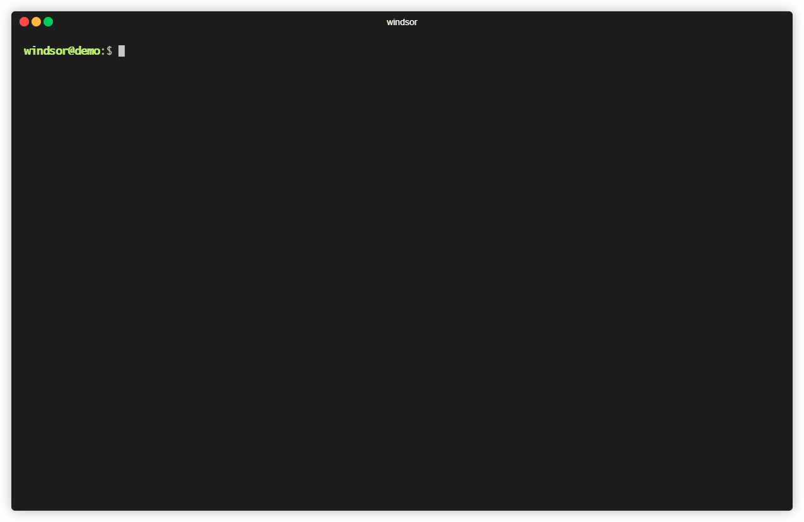

# Windsor
> Toolkit to speed up AWS CDK applications development.

`windsor` is a CLI tool built by [Westpoint](https://westpoint.io) to increase the development speed of applications built using AWS CDK by injecting pre-made code into the project as well as managing dependencie versions and project configurations.

### System requirements
To use `windsor` and all of its features make sure you have the following dependencies installed.

- Python >= 3.6
- npm
- [AWS CLI](https://aws.amazon.com/cli/)
- [AWS CDK](https://aws.amazon.com/cdk/)

### Installation
Install `windsor` using PyPI

`pip install windsor`

## Getting started



### Create a CDK application using windsor
Each CDK app have its own dependencies and must be in its own folder. Start by creating an empty folder in your terminal.

```
$ mkdir my-app
$ cd my-app
```

Start a CDK application running `windsor init`.

The `init` command doesn't need to be ran in an empty folder. If you want to use `windsor` in a project already started, the command `init` will identify your project and create the a configuration file for it.

### Control your dependencies
Windsor can help you manage your CDK dependencies by locking the version of `@aws-cdk/core` and providing commands to install and update these dependencies. The following example shows how to install the package `@aws-cdk/aws-lambda`.

`windsor install aws-lambda`

Notice that you also don't need to specify the namespace `@aws-cdk`, windsor will prefix that in all packages listed to install.

If you have packages with different versions, windsor provides a command to update all of them to the version specified in the `CDKVersion` attribute of `windsor.json` file. To update all your packages run.

`windsor lock`

### Generating resources
`windsor` is able to generate resources with the command `generate`. Each resource generate will be in the form a CDK Construct, meaning that you can extend them and customize as you wish.
**Obs: `windsor` doesn't inject code in files that already exists in your project, that means that for every generated resource, you will need to instanciate the construct into your stack.**

`windsor generate lambda-function --function-name HelloWorld`

The example above shows how to generate a lambda function. The only required parameter to generate lambda functions is `function-name`, since windsor will store a default runtime for them in its configuration. To change the default runtime change the attribute `DefaultRuntime` in windsor configuration file.

## Resources available

`lambda-function`

**Parameters**:
 - function-name
 - runtime

**Example**


```typescript
import * as cdk from '@aws-cdk/core';
import HelloWorldFunction from './constructs/helloworld';

export class WindsortestStack extends cdk.Stack {
  constructor(scope: cdk.Construct, id: string, props?: cdk.StackProps) {
    super(scope, id, props);

    new HelloWorldFunction(this, 'HelloWorldFunction');
  }
}
```

---

`codepipeline-react`

A Pipeline that builds a React Application and sends to a S3 Bucket. The source stage pull code from Github and is triggered every time the branch (specified with the parameter `branch`) is updated.

**Parameters**:
 - pipeline-name

**Example**:


```typescript
import * as cdk from '@aws-cdk/core';
import ReactPipeline from './constructs/react-pipeline';

export class WindsortestStack extends cdk.Stack {
  constructor(scope: cdk.Construct, id: string, props?: cdk.StackProps) {
    super(scope, id, props);

    new ReactPipeline(this, 'ReactPipeline', {
      owner: 'REPOOWNER',
      repo: 'REPONAME',
      oauthToken: 'YOURTOKEN'
    });
  }
}
```
